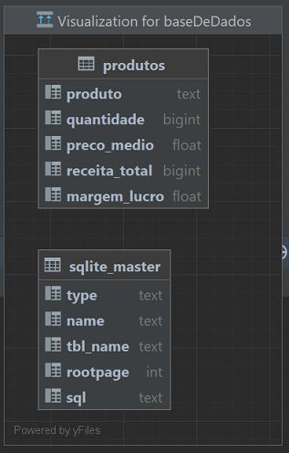
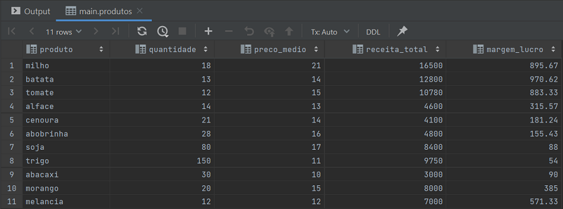
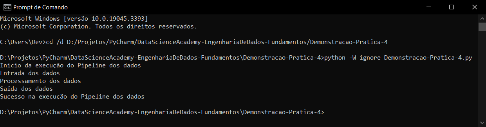

# Demonstração Prática 4 - Criação de Pipeline de Extração, Limpeza, Transformação e Enriquecimento de Dados
Atividade de extrair dados de um arquivo CSV para carregar em um banco de dados e aplicar tarefas de limpeza, 
transformação e enriquecimento dos dados.

## Regras
As regras implementadas no script:
- Os valores de `receita total` devem ser carregados considerando '.' como separador de milhar.
- Os produtos considerados devem ter `quantidade produzida em Kg` > 10.
- Deve-se criar uma nova coluna `margem de lucro = (receita total / quantidade produzida em Kg) - valor médio de venda`.
- As colunas de `receita total` e `margem de lucro` devem ter até 2 casas decimais.
- Os nomes das colunas devem ser: "produto", "quantidade", "preco_medio", "receita_total", "margem_lucro".

## Dados

## Código
Os códigos foram implementados primeiro no arquivo `Demonstracao-Pratica-4.ipynb` 
e depois extraídos e refatorados para o arquivo `Demonstracao-Pratica-4.py`.

A execução de `Demonstracao-Pratica-4.py` foi feita pelo cmd com warnings ignorados:

## Referências
DataScienceAcademy - Fundamentos de Engenharia de Dados:
https://www.datascienceacademy.com.br/path-player?courseid=fundamentos-de-engenharia-de-dados , 
Acessado em 10/09/2023.